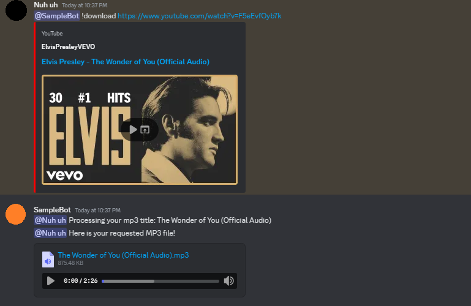

# 🎶 AudioReaper

AudioReaper is a straightforward Discord script that you can use to download MP3s for those who would rather not pay a monthly fee for something they can get for free on YouTube. It converts your Discord account into a bot.

## ✨ Features

- **Convert YouTube to MP3**: This tool makes it simple to download and convert YouTube videos to MP3. 🎥➡️🎵
- **User Control**: Better customization and user management are possible with manual username input. 🛠️
- **No Dependency on discord.py**: Designed to be flexible for various implementations, it does not require the discord.py module. 🚫📦

## 📋 Requirements

Before you start, ensure you have the following:

- A Discord account with permission to create and run bots. 🐦
- A valid Discord token 🔑
- Python installed on your machine. 🐍

## 🚀 How to Use

1. **Insert Token**  
   Enter your Discord bot token.

2. **Set Intent**  
   The recommended intent value is `32767`, which enables all intents. For more information on intents, refer to the [Discord Gateway Documentation](https://discord.com/developers/docs/topics/gateway#list-of-intents). 📜

3. **Insert UserName**  
   Enter your username into the bot manually. Since there isn't an official API for automatic username retrieval, this feature also aims to provide users with greater control and freedom. 🔤

## ⚠️ Disclaimer

I assume no liability for any repercussions that might result from using this program, such as being banned from Discord, among other things. Please follow Discord's rules and terms of service when using this bot, and use it at your own risk. ⚖️

### 🔑 Important Commands

- `!help`: Displays a list of all available commands and their usage. ❓
- `!download <YouTube link>`: Responds to the user after downloading and converting the chosen YouTube video to MP3. ⬇️
- `!status`: Displays the current status of the bot and any ongoing processes. 📊

### Sample
